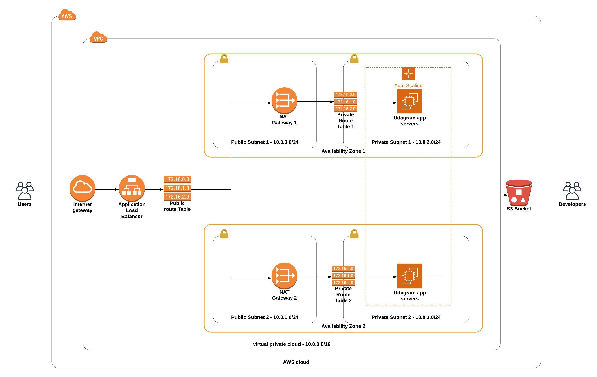

# Udacity Cloud DevOps Engineer Nanodegree

This is the submission for the [_Deploy a high-availability web app using CloudFormation_ project.](instructions.md)

# Architecture

The architecture diagram for this problem is as shown below



# Running Instructions

* To set up the server, you have to first create the network infrastrcture using the command:

```
./create.sh udagram-famisa-infra infra.yml infra-params.json
```
Note: `udagram-famisa-infra` could be substituted with any name of your choice.
* After a `CREATE_COMPLETE` status update on your [AWS CloudFormation console](https://console.aws.amazon.com/cloudformation), you then need to create the servers using the command:

```
./create.sh udagram-famisa-server server.yml server-params.json
```
Note: `udagram-famisa-server` could be substituted with any name of your choice.

* After another `CREATE_COMPLETE` on the server stack, click on the `Outputs` tab of the server stack, and there you will find DNS name to test this app as value to the `key`: `LoadBalancerDNSName`

# Important files:

* [create.sh](create.sh), [update.sh](update.sh) & [delete.sh](delete.sh)
* [infra.yml](infra.yml) - AWS CloudFormation script for setting up network infrastructure - subnets, internet gateway, VPC, private subnets, etc. Corresponding parameters file is [`infra-params.json`](infra-params.json)
* [server.yml](server.yml) - AWS CloudFormation script for setting up server infrastructure and IAM roles. Corresponding parameters file is [`server-params.json`](server-params.json)

Remember to call `./delete.sh <stack-name>` to delete resources to avoid incurring charges